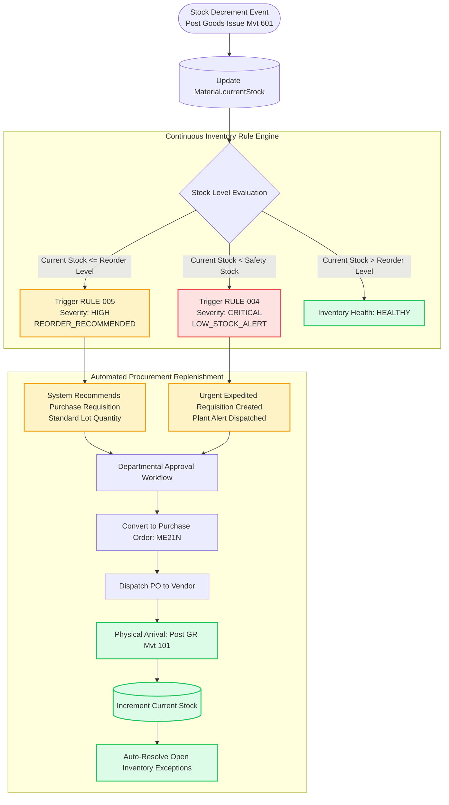

# INVENTORY REORDER & SAFETY STOCK WORKFLOW
## Enterprise Procure-to-Pay (P2P) & Order-to-Cash (O2C) Digital Control Tower

```mermaid
flowchart TD
    EVT([Stock Decrement Event<br>Post Goods Issue Mvt 601]) --> DB[(Update Material.currentStock)]
    
    DB --> CHK_LEVEL{Stock Level Evaluation}

    subgraph Evaluation["Continuous Inventory Rule Engine"]
        CHK_LEVEL -->|Current Stock <= Reorder Level| R_005[Trigger RULE-005<br>Severity: HIGH<br>REORDER_RECOMMENDED]
        CHK_LEVEL -->|Current Stock < Safety Stock| R_004[Trigger RULE-004<br>Severity: CRITICAL<br>LOW_STOCK_ALERT]
        CHK_LEVEL -->|Current Stock > Reorder Level| HEALTHY[Inventory Health: HEALTHY]
    end

    subgraph Remediation["Automated Procurement Replenishment"]
        R_005 --> PR_REC[System Recommends Purchase Requisition<br>Standard Lot Quantity]
        R_004 --> PR_URG[Urgent Expedited Requisition Created<br>Plant Alert Dispatched]
        
        PR_REC & PR_URG --> APPR[Departmental Approval Workflow]
        APPR --> PO_GEN[Convert to Purchase Order: ME21N]
        PO_GEN --> DISP[Dispatch PO to Vendor]
        DISP --> GR_RECV[Physical Arrival: Post GR Mvt 101]
        GR_RECV --> RESTORE[(Increment Current Stock)]
        RESTORE --> CLEAR_EXC[Auto-Resolve Open Inventory Exceptions]
    end

    classDef danger fill:#fee2e2,stroke:#ef4444,stroke-width:2px;
    classDef warning fill:#fef3c7,stroke:#f59e0b,stroke-width:2px;
    classDef success fill:#dcfce7,stroke:#22c55e,stroke-width:2px;
    class R_004 danger;
    class R_005,PR_REC,PR_URG warning;
    class HEALTHY,RESTORE,CLEAR_EXC,GR_RECV success;
```
