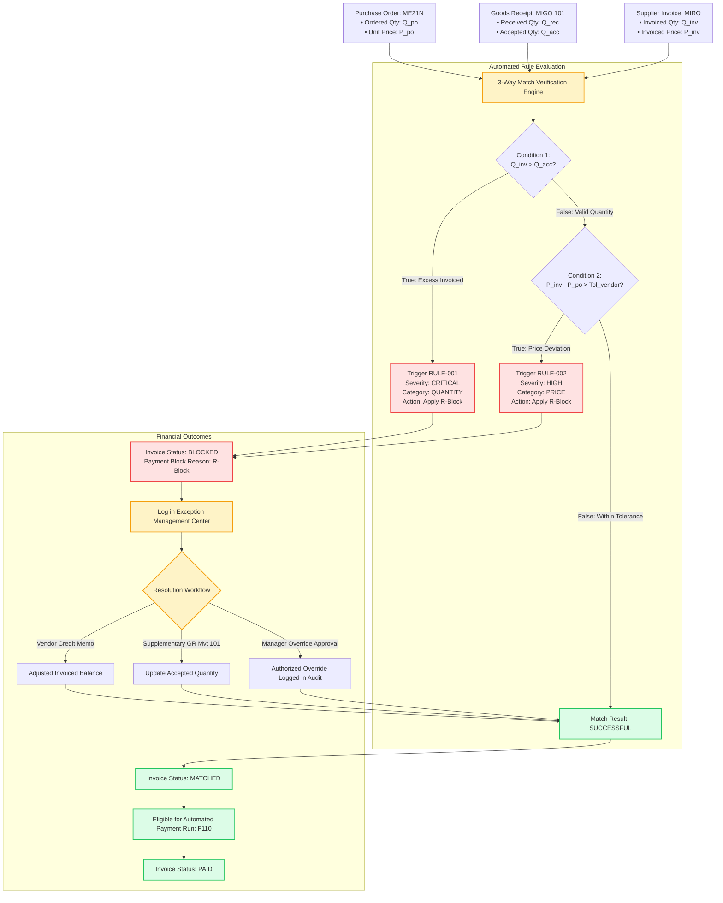

# THREE-WAY MATCHING LOGIC & EXCEPTION FLOW
## Enterprise Procure-to-Pay (P2P) & Order-to-Cash (O2C) Digital Control Tower

```mermaid
flowchart TD
    PO[Purchase Order: ME21N<br>• Ordered Qty: Q_po<br>• Unit Price: P_po]
    GR[Goods Receipt: MIGO 101<br>• Received Qty: Q_rec<br>• Accepted Qty: Q_acc]
    INV[Supplier Invoice: MIRO<br>• Invoiced Qty: Q_inv<br>• Invoiced Price: P_inv]

    PO & GR & INV --> ENGINE[3-Way Match Verification Engine]

    subgraph Evaluation["Automated Rule Evaluation"]
        ENGINE --> CHK_QTY{Condition 1:<br>Q_inv > Q_acc?}
        CHK_QTY -->|True: Excess Invoiced| EXC_QTY[Trigger RULE-001<br>Severity: CRITICAL<br>Category: QUANTITY<br>Action: Apply R-Block]
        CHK_QTY -->|False: Valid Quantity| CHK_PRICE
        
        CHK_PRICE{Condition 2:<br>P_inv - P_po > Tol_vendor?}
        CHK_PRICE -->|True: Price Deviation| EXC_PRICE[Trigger RULE-002<br>Severity: HIGH<br>Category: PRICE<br>Action: Apply R-Block]
        CHK_PRICE -->|False: Within Tolerance| PASS[Match Result: SUCCESSFUL]
    end

    subgraph Settlement["Financial Outcomes"]
        EXC_QTY & EXC_PRICE --> BLOCK_STATE[Invoice Status: BLOCKED<br>Payment Block Reason: R-Block]
        BLOCK_STATE --> WORKBENCH[Log in Exception Management Center]
        
        WORKBENCH --> RES{Resolution Workflow}
        RES -->|Vendor Credit Memo| ADJ_INV[Adjusted Invoiced Balance]
        RES -->|Supplementary GR Mvt 101| ADJ_GR[Update Accepted Quantity]
        RES -->|Manager Override Approval| APPR_OVR[Authorized Override Logged in Audit]
        
        ADJ_INV & ADJ_GR & APPR_OVR --> PASS
        PASS --> STATUS_MATCH[Invoice Status: MATCHED]
        STATUS_MATCH --> PAY_RUN[Eligible for Automated Payment Run: F110]
        PAY_RUN --> PAID[Invoice Status: PAID]
    end

    classDef danger fill:#fee2e2,stroke:#ef4444,stroke-width:2px;
    classDef success fill:#dcfce7,stroke:#22c55e,stroke-width:2px;
    classDef warning fill:#fef3c7,stroke:#f59e0b,stroke-width:2px;
    class EXC_QTY,EXC_PRICE,BLOCK_STATE danger;
    class PASS,STATUS_MATCH,PAY_RUN,PAID success;
    class ENGINE,WORKBENCH,RES warning;
```
